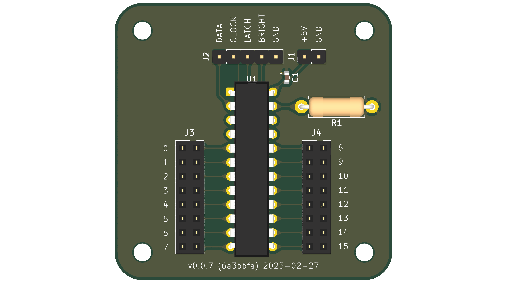
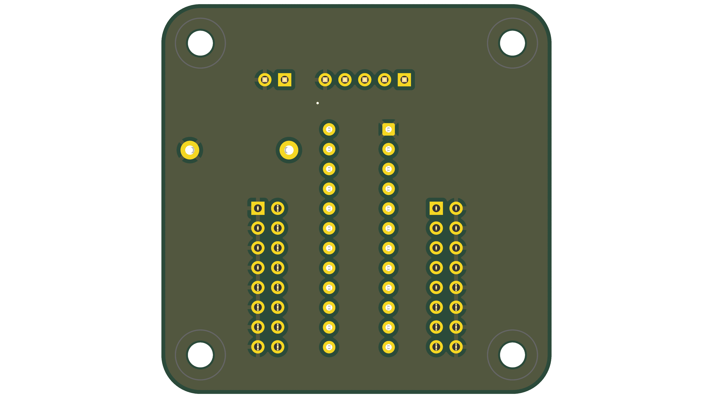

# DM13A breakout board

Breakout board for the DM13A LED driver, for use with MobiFlight. This is completely untested and not intended for real-world use. The goal of this repo was to explore using KiCad 9 command line tools to automate releases of the design, including schematics, board images, and JLCPCB fabrication files.

Highlights:

* A VSCode devcontainer is included that includes the `kicad-cli` command for local development.
* A `tasks.json` file is included to enable quick local testing of the jobset generation.
* Outputs are defined using KiCad [jobsets](https://docs.kicad.org/9.0/en/kicad/kicad.html#jobsets).
* Variables are used to specify a version and date stamp. These are used in the sheet data blocks as well as the silkscreen on the board.
* A GitHub [workflow](https://github.com/neilenns/dm13a-breakout-board/blob/main/.github/workflows/release.yaml) runs when a GitHub release is created, or when triggered manually, to produce all the output files. The version variable is set to the GitHub release version and the date stamp is set to the year, month, and day of the GitHub release.
* Output files are modified by the workflow to match the JLCPCB upload requirements.
* The completed outputs are uploaded to the [release](https://github.com/neilenns/dm13a-breakout-board/releases) for easy access.
* Board images are automatically checked in to the docs directory via an auto-merged pull request, for use in this readme.

